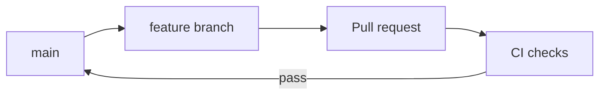

# Agile methodology and branching strategies

This document describes how the team works for this microservices demo project.

## Team model: pair work (taller en parejas)

The course workshop is done **in pairs** (two students). The process below is sized for a **two-person team**, not a large squad.

- **Shared ownership:** Both partners are **Developers** and contribute to application code, pipelines, Helm, and documentation. Split work by theme (e.g. one partner leads **vote/result** and CI app workflows, the other **worker/infrastructure** and local Kubernetes scripts) while keeping **shared reviews**.
- **Scrum roles in a pair:** Roles are **lightweight**:
  - **Product Owner** can be **shared** (both agree on backlog priority for the assignment rubric) or **rotated** per sprint.
  - **Scrum Master** can **rotate weekly** or be the partner who tracks blockers and ceremony timeboxes.
  - **Developers:** both partners, with explicit **pair review** on every pull request before merge.
- **Dev and ops:** The rubric asks for both **development** and **operations** perspectives. In the pair, ensure **both** touch CI/CD and cluster deployment (e.g. one prepares GitHub Actions, the other validates `kind` + `deploy-local.ps1`), even if tasks are not split 50/50 every day.
- **Ceremonies:** Keep them short: a **15-minute planning** per week, a **daily sync** (even 10 minutes between the two), and a **review/retro** before each milestone.

**Artifacts:** product backlog (GitHub Issues or a simple list), sprint backlog (issues pulled into the iteration), increment (working software + docs in `main`).

## Agile methodology: Scrum

We use **Scrum** for the following reasons:

- **Time-boxed iterations (sprints)** of one to two weeks align with course milestones and deliverables.
- **Defined roles** (Product Owner, Scrum Master, Developers) still apply; in a **pair**, they are **combined or rotated** so both students stay involved (see *Team model* above).
- **Ceremonies** (sprint planning, daily stand-ups, sprint review, retrospective) give structure for both **development** and **operations** work (pipelines, Helm, local Kubernetes).
- **Increment** at the end of each sprint matches the rubric items (CI, infra pipelines, documentation).

**Alternative considered:** Kanban works well for continuous operations-heavy work; we chose Scrum because the assignment is organized as phased deliverables.

---

## Branching strategy — development (GitHub Flow)

We follow **GitHub Flow**:

1. **`main`** is always in a releasable state (tests and Docker builds pass in CI).
2. **Short-lived branches** from `main`: `feature/<short-description>` or `fix/<issue-id>`.
3. **Pull requests** are mandatory; they run **ci-app** and **ci-infra** before merge.
4. **Merge to `main`** only after green checks and **review by the other partner** (in a pair, the non-author should approve or explicitly acknowledge review in the PR description if branch protection is not enabled).

**Repository settings (recommended):**

- Protect `main`: require PR, require status checks (`ci-app`, `ci-infra`), and **require at least one approving review** when both partners have GitHub access (ideal for pair accountability).

---

## Branching strategy — operations / releases

Application code and infrastructure live in the **same monorepo** for simplicity, but we treat them conceptually as different concerns:

| Concern | Practice |
|--------|-----------|
| **Source of truth** | `main` for both app and Helm charts. |
| **Releases** | **Git tags** with semantic versioning (`v1.0.0`) when a milestone is ready; tags reference the exact commit used for demos and reports. |
| **Infrastructure changes** | Helm values and templates under `infrastructure/` and `*/chart/` go through the same PR process; **ci-infra** validates `helm lint` / `helm template` before merge. |
| **Environments** | For this project, **local Kubernetes (kind)** consumes images from **GHCR** built by CI. Promotion is **manual or scripted** on the lab machine (see [local-kubernetes.md](local-kubernetes.md) and [cd-from-github-to-local.md](cd-from-github-to-local.md)). |

This is a **GitOps-light** approach: changes are reviewed and validated in Git; deployment to the local cluster is either a **follow-up script** after a green pipeline or a **self-hosted runner** (optional), because GitHub-hosted runners cannot reach `localhost` Kubernetes on your PC.

---

## Summary

| Topic | Choice |
|-------|--------|
| Team size | Pair (two students); roles combined or rotated |
| Agile framework | Scrum |
| Developer workflow | GitHub Flow + partner review on PRs |
| Releases | Tags on `main` |
| Infra validation | Dedicated CI workflow + PR gates |
