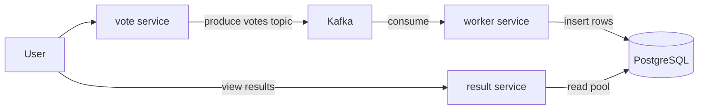
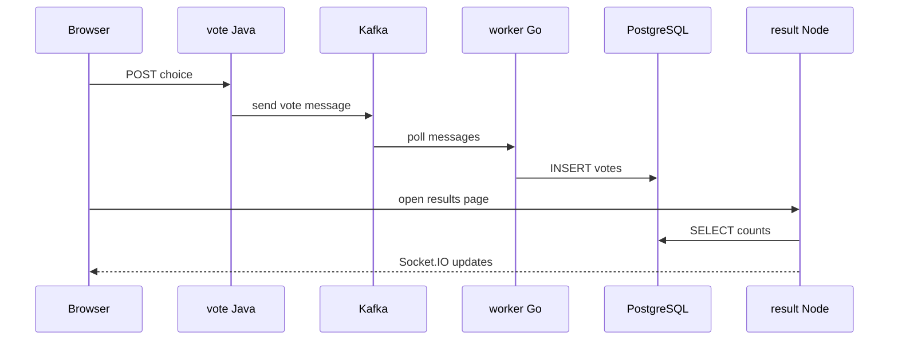

# Architecture and cloud design patterns

## System overview

The application is a **polyglot microservices** sample: a **vote** web UI (Java/Spring Boot) sends votes to **Kafka**; a **worker** (Go) consumes messages and persists to **PostgreSQL**; a **result** UI (Node.js) reads aggregated data from PostgreSQL and pushes updates over WebSockets.

### Sequence: casting a vote

---

## Cloud design patterns (minimum two)

### 1. Event-driven architecture (asynchronous messaging)

**Evidence:** The **vote** service does not call the **worker** directly. It publishes to Kafka (`votes` topic); the **worker** consumes asynchronously. This provides **temporal decoupling** and allows scaling producers and consumers independently.

**Where to look:** `vote` uses Spring Kafka; `worker` uses Sarama; infrastructure chart deploys Kafka under [infrastructure/templates/kafka.yaml](../infrastructure/templates/kafka.yaml).

### 2. Database per service (logical)

**Evidence:** **Worker** owns writes to the `votes` table; **result** reads from the same database for the demo. In production, each service would typically own **its** database instance; here the schema is shared for simplicity, but responsibilities are separated by **access path**: writes flow through the worker pipeline; the results UI performs read-only queries.

**Improvement note:** Physical isolation (separate PostgreSQL instances or schemas per service) would strengthen the pattern.

### 3. Optional: Edge routing (Ingress)

**Evidence:** Helm charts for **vote** and **result** include Ingress templates for HTTP routing when enabled. For local kind clusters, Ingress may be disabled in favor of `kubectl port-forward`.
